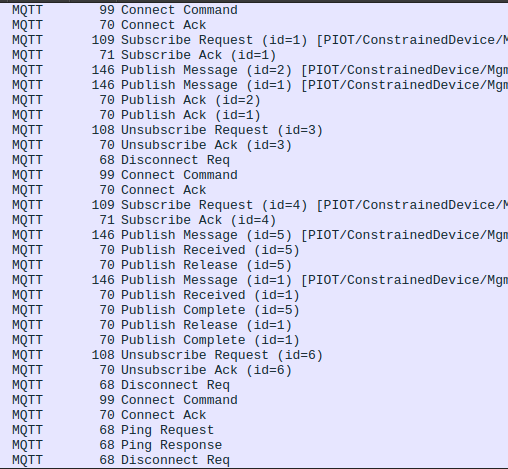

# Constrained Device Application (Connected Devices)

## Lab Module 06

Be sure to implement all the PIOT-CDA-* issues (requirements) listed.

### Description

NOTE: Include two full paragraphs describing your implementation approach by answering the questions listed below.

What does your implementation do?
Ahora el CDA cuenta con la capacidad de suscribirse a un Topic de MQTT o publicar en él. E objetivo de esta implementación es que se pueda comunicar con el GDA para enviar los datos de los sensores publicándolos y suscribirse a un Topic para saber que tendránq ue hacer sus actuadores.

How does your implementation work?
Para el proceso de conectarse al servidor de MQTT, publicar y suscribirse, se ha creado una clase MqttClientConnector que hereda de la clase IPubSubClient e implementa todas las funciones necesarias para manejar un cliente de la clase mqttClient de python. Esta nueva clase, se implementa en el DeviceDataManager para, en un módulo futuro, publicar los valores de los sensores.

### Code Repository and Branch

NOTE: Be sure to include the branch.

URL: 

### Unit Tests Executed

NOTE: The instructor will execute your unit tests. You only need to list each test case below
(e.g. ConfigUtilTest, DataUtilTest, etc). Be sure to include all previous tests, too,
since you need to ensure you haven't introduced regressions.

- 
- 
- 

### Integration Tests Executed

NOTE: The instructor will execute most of your integration tests using their own environment, with
some exceptions (such as your cloud connectivity tests). In such cases, they'll review
your code to ensure it's correct. As for the tests you execute, you only need to list each
test case below (e.g. SensorSimAdapterManagerTest, DeviceDataManagerTest, etc.)

- MqttClientConnectorTest
- MqttClientControlPacketTest
- 

EOF.
