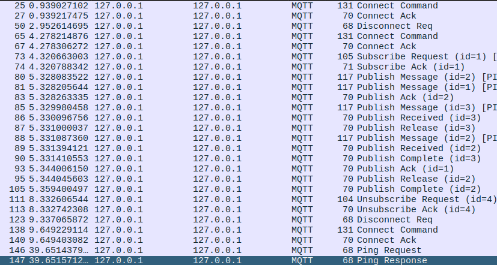

# Gateway Device Application (Connected Devices)

## Lab Module 07

Be sure to implement all the PIOT-GDA-* issues (requirements) listed.

### Description

NOTE: Include two full paragraphs describing your implementation approach by answering the questions listed below.

What does your implementation do? 
Permite que el GDA se conecto al servidor MQTT, publique en un topic o se suscriba. Además de manejar los callback. Por ahora todo de manera síncrona.

How does your implementation work?
Para conseguirlo, se crea la clase MqttClientConnector que emplea la librería paho.client.mqttv3. esta clase se encarga de conectarse, desconectarse, publicar los mensajes, suscribirse y desuscribirse a topics y manejar los callback. Esta clase se encapsula en el DeviceDataManager, puesto que le servirá a este para manejar los datos que lleguen del CDA.

### Code Repository and Branch

NOTE: Be sure to include the branch.

URL: https://github.com/Sergiooo0/PIC-java-components/tree/modulo07

### Unit Tests Executed

NOTE: The instructor will execute your unit tests. You only need to list each test case below
(e.g. ConfigUtilTest, DataUtilTest, etc). Be sure to include all previous tests, too,
since you need to ensure you haven't introduced regressions.

- 
- 
- 

### Integration Tests Executed

NOTE: The instructor will execute most of your integration tests using their own environment, with
some exceptions (such as your cloud connectivity tests). In such cases, they'll review
your code to ensure it's correct. As for the tests you execute, you only need to list each
test case below (e.g. SensorSimAdapterManagerTest, DeviceDataManagerTest, etc.)

- MqttClientConnectorTest
- MqttClientControlPacketTest
- 

EOF.
