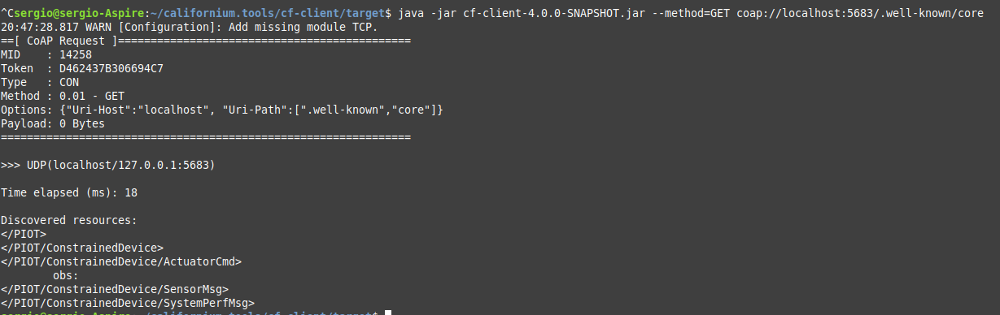
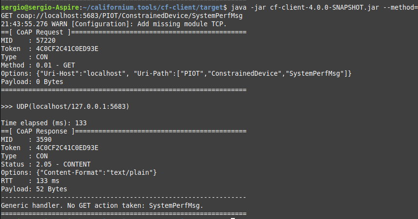
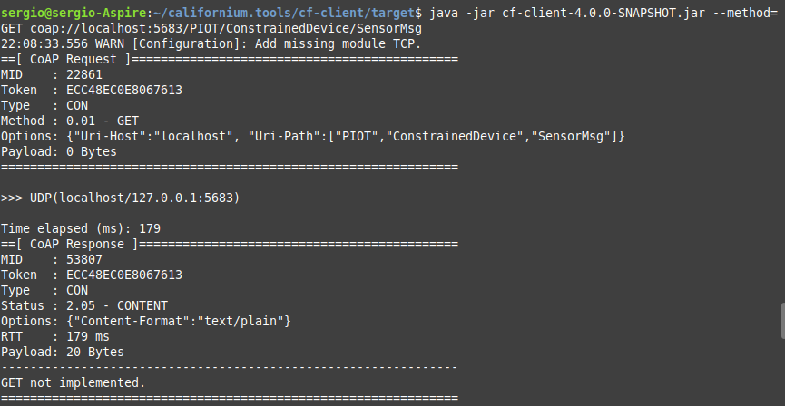
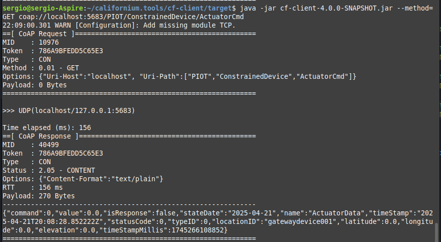

# Gateway Device Application (Connected Devices)

## Lab Module 08

Be sure to implement all the PIOT-GDA-* issues (requirements) listed.

### Description

NOTE: Include two full paragraphs describing your implementation approach by answering the questions listed below.

What does your implementation do?

Mi implementación crea y gestiona un servidor CoAP dentro del Gateway Data Application (GDA), permitiendo la comunicación entre dispositivos IoT mediante recursos jerárquicos bien estructurados. Registra automáticamente los recursos necesarios para recibir datos de telemetría, desempeño del sistema y comandos para actuadores, y también permite agregar recursos personalizados desde otros componentes como el DeviceDataManager. Todo esto facilita la interoperabilidad y el manejo eficiente de datos en entornos IoT restringidos.

How does your implementation work?

La clase CoapServerGateway instancia un servidor CoAP y registra recursos siguiendo una estructura de árbol basada en las rutas jerárquicas definidas en ResourceNameEnum. Al iniciar el servidor, se crean y agregan manejadores de recursos por defecto que escuchan e interpretan los mensajes entrantes. Además, se implementa un método para añadir recursos personalizados dinámicamente, descomponiendo su ruta y construyendo la cadena de recursos apropiada. Esto garantiza flexibilidad, escalabilidad y compatibilidad con el modelo de datos del GDA.

### Code Repository and Branch

NOTE: Be sure to include the branch.

URL: 

### Unit Tests Executed

NOTE: The instructor will execute your unit tests. You only need to list each test case below
(e.g. ConfigUtilTest, DataUtilTest, etc). Be sure to include all previous tests, too,
since you need to ensure you haven't introduced regressions.

- 
- 
- 

### Integration Tests Executed

NOTE: The instructor will execute most of your integration tests using their own environment, with
some exceptions (such as your cloud connectivity tests). In such cases, they'll review
your code to ensure it's correct. As for the tests you execute, you only need to list each
test case below (e.g. SensorSimAdapterManagerTest, DeviceDataManagerTest, etc.)

- CoapServerGatewayTest
- 

Para ejecutar el último hay que tener clonado el github:

`git clone https://github.com/eclipse/californium.tools.git`

`cd californium.tools`

`mvn clean install`

Ejecutar el test y acto seguido esto por terminal:

`cd cf-client\target`

`java -jar cf-client-4.0.0-SNAPSHOT.jar --method=GET coap://localhost:5683/.well-known/core`

`java -jar cf-client-4.0.0-SNAPSHOT.jar --method=GET coap://localhost:5683/PIOT/ConstrainedDevice/SystemPerfMsg`

`java -jar cf-client-4.0.0-SNAPSHOT.jar --method=GET coap://localhost:5683/PIOT/ConstrainedDevice/SensorMsg`

`java -jar cf-client-4.0.0-SNAPSHOT.jar --method=GET coap://localhost:5683/PIOT/ConstrainedDevice/ActuatorCmd`

Resultado:

EOF.
