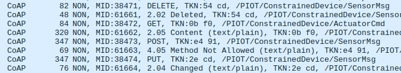
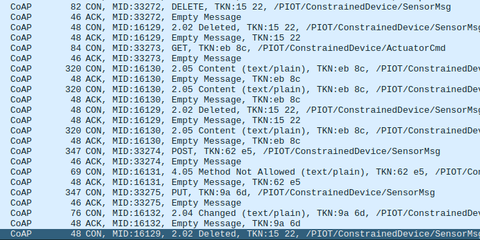

# Constrained Device Application (Connected Devices)

## Lab Module 09

Be sure to implement all the PIOT-CDA-* issues (requirements) listed.

### Description

NOTE: Include two full paragraphs describing your implementation approach by answering the questions listed below.

What does your implementation do? 

Mi implementación define un cliente CoAP que permite enviar y recibir mensajes a través del protocolo CoAP. Este cliente puede realizar operaciones básicas como descubrimiento de recursos, envío de solicitudes GET, POST, PUT y DELETE, así como observar recursos para recibir notificaciones cuando cambian. También maneja la recepción de comandos para actuadores, permitiendo la comunicación y control remoto de dispositivos IoT.

How does your implementation work?

La implementación utiliza la librería coapthon para crear un cliente CoAP que se conecta a un servidor remoto (el GDA). Los métodos implementados construyen rutas hacia los recursos usando enumeraciones o nombres, y envían solicitudes CoAP según el tipo (GET, POST, PUT, DELETE). También permite establecer observadores sobre recursos para recibir actualizaciones automáticas. Las respuestas recibidas se manejan con funciones que procesan los datos y, si es necesario, notifican a un oyente (listener) que implementa la interfaz IDataMessageListener, permitiendo así la integración con el resto del sistema.

### Code Repository and Branch

NOTE: Be sure to include the branch.

URL: 

### Unit Tests Executed

NOTE: The instructor will execute your unit tests. You only need to list each test case below
(e.g. ConfigUtilTest, DataUtilTest, etc). Be sure to include all previous tests, too,
since you need to ensure you haven't introduced regressions.

- 
- 
- 

### Integration Tests Executed

NOTE: The instructor will execute most of your integration tests using their own environment, with
some exceptions (such as your cloud connectivity tests). In such cases, they'll review
your code to ensure it's correct. As for the tests you execute, you only need to list each
test case below (e.g. SensorSimAdapterManagerTest, DeviceDataManagerTest, etc.)

- CoapClientConnectorTest
- 
- 

Para ejecutar el test se debe de ejecutar el test CoaPServerGatewayTest.java del GDA previamente. Mientras se ejecuta este, ejecutar CoapClientConnectorTest.

Haciendo esto en Wireshark se ha obtenido lo siguiente:

Por un lado, extracto de las peticiones (DELETE, PUT, POST, GET) NON:

Petciones CON:

EOF.
