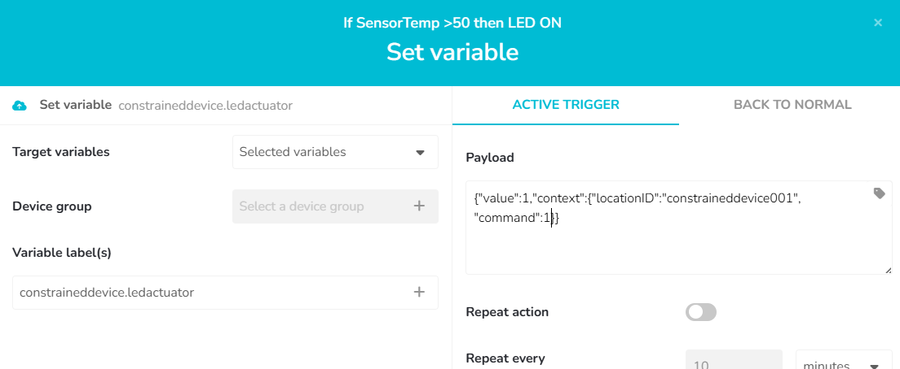

# Gateway Device Application (Connected Devices)

## Lab Module 11

Be sure to implement all the PIOT-GDA-* issues (requirements) listed.

### Description

NOTE: Include two full paragraphs describing your implementation approach by answering the questions listed below.

What does your implementation do? 
Mi implementación se conecta a un servidor a la nube por mqtt, donde puede publicarse topics y suscribirse a ellos. El servidor puede decir encender o apagar un LED del CDA, recibirá el comando y actuará en consecuencia.

How does your implementation work?
Adaptamos la calse MqttClientConnector para que cumpla con las utilidades de los módulos anteriores y ahora también se conecte al cloud. CloudClientConnector implementa la clase de Mqtt y DeviceDataManager, a su vez, implementa CloudClientConnector. El formato del json con el que se comunican el GDA y el CDA es distinto al que usa el Ubidots; por lo tanto, se ha añadido una función a DataUtils para pasar el formato del json al del cloud y otra para hacer el paso contrario.

Esto es el formato del JSON que tuve que poner para que el comando de activación del LED llegara correctamente desde el cloud pasadno por el GDA:

Cuando el sensor del CDA supera los 50 grados, se activa el evento. locationID indica que es para el CDA de manera que este no lo ignore y command: 1 significa ON. Value no se utiliza.

### Code Repository and Branch

NOTE: Be sure to include the branch.

URL: 

### Unit Tests Executed

NOTE: The instructor will execute your unit tests. You only need to list each test case below
(e.g. ConfigUtilTest, DataUtilTest, etc). Be sure to include all previous tests, too,
since you need to ensure you haven't introduced regressions.

- 
- 
- 

### Integration Tests Executed

NOTE: The instructor will execute most of your integration tests using their own environment, with
some exceptions (such as your cloud connectivity tests). In such cases, they'll review
your code to ensure it's correct. As for the tests you execute, you only need to list each
test case below (e.g. SensorSimAdapterManagerTest, DeviceDataManagerTest, etc.)

- MqttClientConnectorTest
- CloudClientConnectorTest
- 

EOF.
