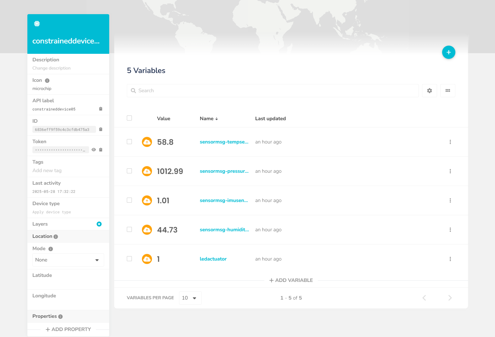
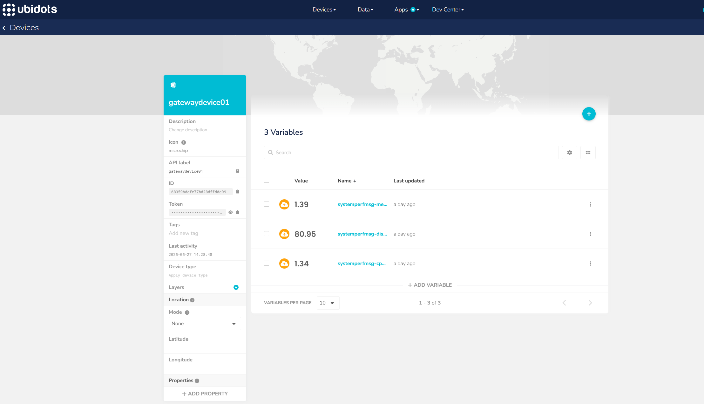
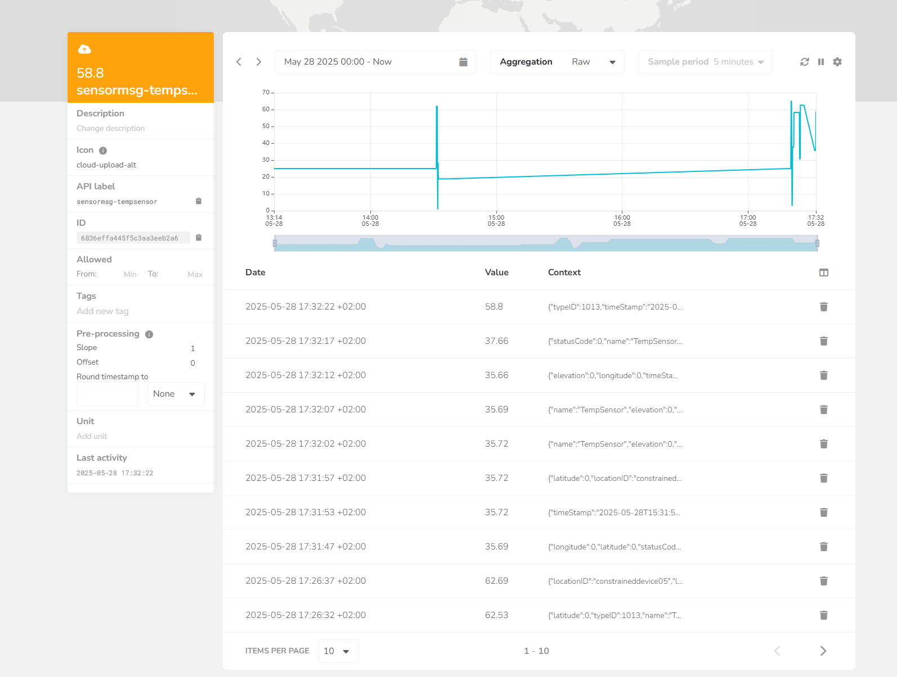
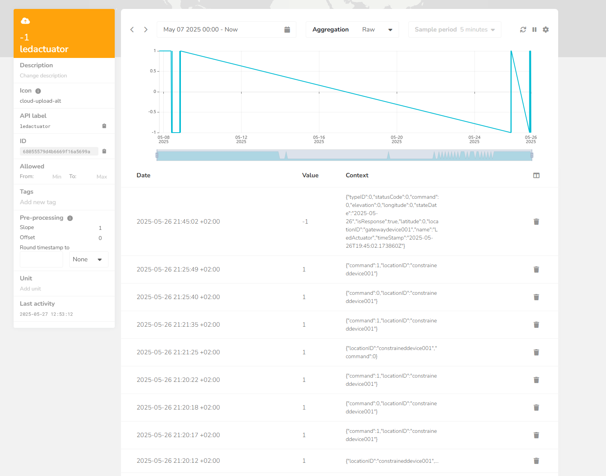
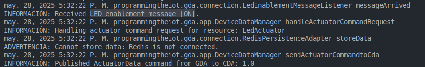
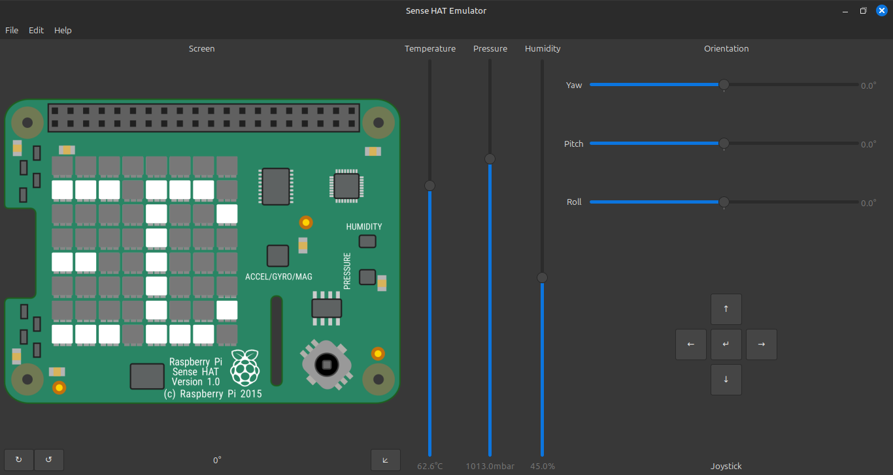
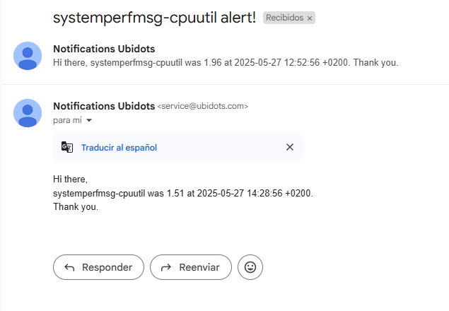

# Lab Module 12 - Semester Project - Final Write-up

NOTE: Be sure to implement all the Lab Module 12 requirements listed at Lab Module 12.

## Description

Describe your idea in 1 paragraph (at least 2 or 3 sentences).
Inicialmente la idea fue mejorar la aplicación del CDA y del GDA para que pudieran aceptar más de un CDA a la vez. Que se pudiera lanzar en distintas terminales la aplicación del CDA, que cada uno tuviera distintos IDs; que el GDA pudiera gestionar cada uno de ellos correctamente; almacenar en el cloud los datos de cada sin mezclarse y que ningún CDA activara un actuador cuando le correspondia a otro.

Una vez cumplido esto, el siguiente objetivo fue sacarle partido a la IMU emulada. A partir de la aceleración en los tres ejes determinar si la vibración de una máquina era demasiada; indicativo de una avería.

## What - The Problem 

What problem did you tackle and why does it matter? Write 1 to 2 paragraphs in response.
El problema principal que presentaba el proyecto era que no se podía lanzar más de un CDA. No tiene sentido tener un gateway y un servidor cloud para un único dispositivo. Sin los cambios necesarios, lanzar en dos terminales el CDA provocaba que ambos tuvieran el mismo ID y el GDA los interpretara sus mensajes como los del mimso dispositivo.

Por otro lado, un sensor que mida la vibración puede servir para una detección temprana de fallos. Aprovechando esto, el CDA puede avisar para que un técnico arregle la máquina antes de que esta pare la línea de producción.

## Why - Who Cares? 

Why do you care about this particular problem? Write 1 to 2 paragraphs in response.
Este problema es relevante porque limita la escalabilidad del sistema. En un entorno industrial real, se espera que varios dispositivos trabajen simultáneamente y de forma coordinada. Si cada CDA no puede operar de forma independiente, el sistema no es viable a gran escala. Además, la posibilidad de gestionar múltiples CDAs correctamente desde el GDA mejora notablemente la robustez del sistema.

También importa porque la detección temprana de fallos mediante vibraciones puede evitar costosos paros de producción. Incorporar esta funcionalidad usando la IMU emulada permite dar un paso hacia el mantenimiento predictivo, algo muy valorado en la industria moderna.

## How - Expected Technical Approach

Write 1 to 2 paragraphs describing the outcomes you achieved.

Para abordar el problema de la escalabilidad, se mantuvo la forma original de lanzar el CDA (este usará el ID por defecto definido en el archivo Piot.config). Para lanzar otro CDA, se debe de pasar como parámetro el nuevo ID ('python ConstrainedDeviceApp.py --id <nuevo_id>'). De esta manera, cada CDA tendrá un ID único y el GDA podrá gestionar múltiples CDAs sin confusiones. El GDA ahora almacena los datos de cada CDA en el cloud con un topic específico para cada uno, evitando que se mezclen los datos. Sin embargo, los CDAs extras no pueden emular la rasperry pi, puesto que la clase SenseHAT no permite crear más de un objeto. Por lo tanto, los nuevos CDAs simularán el dispositivo. Además, de que sí se almacenan sus datos en el cloud, independientemente del ID, pero no se activará ningún evento en el cloud para estos. Esto se debe a que habría que crear un evento específico para cada CDA. Se podría hacer uno para grupo de sensores, pero eso sería un función premium de Ubidots.

Por la parte de las vibraciones, el CDA periódicamente obtiene la aceleración de los tres ejes (x, y, z), se calcula la magnitud de la aceleración mediante la raíz cuadrada de la suma de los cuadrados de las aceleraciones en cada eje. El valor se envía al GDA, que lo almacena en el cloud. También el GDA comprueba si la magnitud supera un umbral, en cuyo caso envía un mensaje al CDA para que active el actuador que indica que hay una vibración excesiva o crítica. El CDA recibe este mensaje y muestra una alerta en la pantalla LED.

### System Diagram

Embed a block diagram depicting your overall design, including the CDA, GDA, and Cloud Services interactions.
Be sure to include arrows depicting data flow from one application / service to the next.

CDA → (MQTT) → GDA → (MQTT) → Cloud

Cloud → (MQTT) → GDA → (MQTT) → CDA

Write 1 to 2 paragraphs describing your design.

El diseño del sistema se basa en una arquitectura de microservicios donde cada componente (CDA, GDA y Cloud) se comunica de manera eficiente a través de MQTT. Esto permite una escalabilidad sencilla, ya que se pueden añadir más CDAs sin necesidad de modificar el GDA o el Cloud. Cada CDA se identifica de forma única mediante su ID, lo que facilita la gestión de múltiples dispositivos. El GDA actúa como intermediario, recibiendo datos de los CDAs y publicándolos en la nube, mientras que también puede enviar comandos de vuelta a los CDAs en función de los datos recibidos. La activación de los actuadores en los CDAs no sólo se basan en decisiones del Cloud, sino que el GDA también puede tomar decisiones sin intervención del Cloud, al igual que el CDA puede actuar de forma autónoma si es necesario.

### What THREE (3) sensors and ONE (1) actuator did you use (add more if you wish)?

- CDA Sensor 1: Temperatura

- CDA Sensor 2: Presión

- CDA Sensor 3: Humedad

- CDA Sensor 4: Aceleración

- CDA Actuator 1: HVAC

- CDA Actuator 2: Humidificador

- CDA Actuator 3: Alerta de vibración

### What ONE (1) CDA protocol and TWO (2) GDA protocols did you implement (add more if you wish)?

- CDA to GDA Protocol: MQTT (está implementado CoAP pero no se usa)

- GDA to CDA Protocol: MQTT (está implementado CoAP pero no se usa)

- GDA to Cloud Protocol: MQTT

- Cloud to GDA Protocol: MQTT

 
### What TWO (2) cloud services / capabilities did you use (add more if you wish)?

- Cloud Service 1 (data ingress - all inputs): Ubidots

- Cloud Service 2 (data egress - all actuation events): Ubidots

## Screen Shots Representing Cloud Services

### Screen Shots Representing Visualized Data

NOTE: Include (at least) TWO (2) screen shots - one showing at least 1 hour
of time-series data from the CDA, and one showing an event being triggered
that results in an actuation event sent to your GDA and then to your CDA.

En relación con los eventos: 

Por un lado diferentes activaciones del evento de encender el LED del CDA cada vez que la temperatura supera los 50 grados.

Cuando este se activa, esto es lo que vemos en el GDA:

Finalmente, esto en el CDA:

(el mensaje se activa en la pantalla LED del CDA, no se ve del todo pero se intuye que pone "LED ON" en la pantalla)

Implementé un evento también que envía un mensaje cuando la CPU del GDA está trabajando:

EOF.
